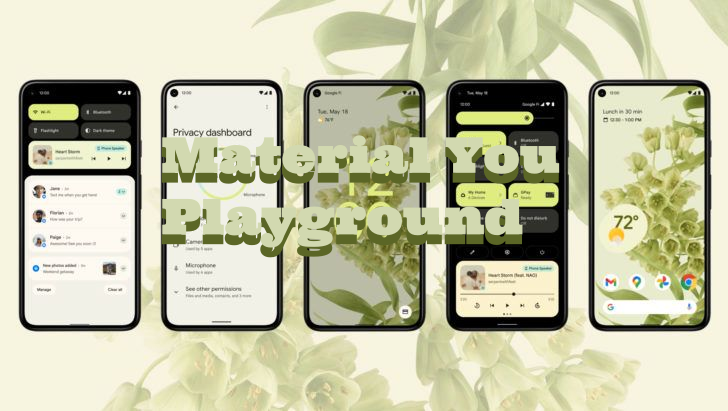

# Material You Playground

Flutter's migration to Material Design 3 is not fully in place. This is to document recipes to migrate to Material Design 3 with some work-arounds.

## Articles

Articles at my Medium Blog:

[My Medium Blog}(https://fredgrott.medium..com)

## Resources

[Material Design 3 Spec](https://m3.material.io/)